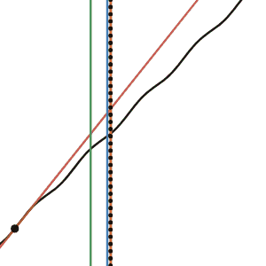

# Table of Contents
- [Introduction](#introduction)
- [Hisorical Significance](#historical-significance)
- [Key Methods](#key-methods)
- [Challenges](#challenges)
- [Applications](#applications)
- [Conclusion](#conclusion)
- [References](#references)

# Multidimensional Methods for Root Finding

## Introduction

This article explores multidimensional root-finding methods, providing an overview of how a few key approaches work, their unique characteristics, and the factors that make solving these problems more complex than their one-dimensional counterparts.

All Graphics used in this Project were made in Desmos, here is a link to the project "files"

## Historical Significance

During the late 17th century, astronomers faced a pressing challenge: predicting the motion of planets accurately. Johannes Kepler had formulated his famous laws of planetary motion, including the law that planets move in elliptical orbits with the Sun at one focus. However, determining the exact position of a planet at a given time required solving a key equation known as **Kepler's Equation**:

$$
M = E - esin(E)
$$

Where:

- **M** is the mean anomaly (a measure of time within the orbital period).
- **E** is the eccentric anomaly (related to the position of the planet along its orbit).
- **e** is the orbital eccentricity (a measure of how elliptical the orbit is).

Kepler's Equation is transcendental, meaning it involves a mix of algebraic and non-algebraic functions (in this case, trigonometric), making it impossible to solve exactly using standard algebraic methods. As a result, iterative numerical techniques are required to approximate the solution for E. This posed a major problem for astronomers who needed precise planetary positions for navigation, calendar design, and understanding celestial mechanics.

In this visualization, The purple dot represents the planet, the Sun is the big orange one at the focus of the elipse, and the eccentric anomaly (E), is the angle between the semi-marjor axis (the green line) and the line connecting the center of the ellipse to the planet's projection onto the circumscribed circle.

Without a method to solve such equations efficiently, progress in astronomy and related sciences would have been severely limited. It was in this context that Newton's contributions became revolutionary. By introducing an iterative approach that could refine approximate solutions, Newton offered a "method" to solving equations like Kepler's. Some may even call it Newton's Method perhaps.

### Newton's Method

Newton's Method is a 1 dimensional root approximating tequenique. That is, it let's you approximate for the value of x where f(x) = 0.

1. Find the tangent line of the function you are trying to approximate at any random point on the function.
2. Simply find the root of that tangent line.
3. Plug it into this function:

$$
x_{n+1} = x_n - \frac{f(x_n)}{f'(x_n)}
$$

The formula predicts the root $x_{n+1}$ by subtracting the last root predicted, in this case the x-intercept of the tangent line, by the value of the function at that point over the derivative of the function at that point.

4. Plug that new value back into the function and repeat until satisfied.

We can approximate the solution to Kepler's Equation using this method:

Start with the formula from earlier:

$$
M = E - esin(E)
$$

and rearrange it so that we are solving for the root:

$$
0 = E - esin(E) - M
$$

Now, if we make that the function $f(x_n)$ and plug it into Newton's method:

$$
E_{n+1} = E_n - \frac{E_n - e \sin(E_n) - M}{1 - e \cos(E_n)}
$$

#### Let's say:
- Mean anomaly \( M = 0.75 \) radians
- Orbital eccentricity \( e = 0.3 \)
- Initial guess \( E_0 = 0.75 \) radians

#### Iteration Steps:

1. **Iteration 1:**

$$
E_1 = E_0 - \frac{E_0 - e \sin(E_0) - M}{1 - e \cos(E_0)}
$$

   Substitute values:

   $$
   E_1 = 0.75 - \frac{0.75 - 0.3 \sin(0.75) - 0.75}{1 - 0.3 \cos(0.75)}
   $$

   Simplify:

   $$
   E_1 \approx 0.784
   $$

2. **Iteration 2:**

$$
   E_2 = E_1 - \frac{E_1 - e \sin(E_1) - M}{1 - e \cos(E_1)}
   $$

   Substitute values:

   $$
   E_2 = 0.784 - \frac{0.784 - 0.3 \sin(0.784) - 0.75}{1 - 0.3 \cos(0.784)}
   $$

   Simplify:

   $$
   E_2 \approx 0.785
   $$

Below is a graphical representation running Euler's Method on Kepler's Equations applied at different starting points:

Where the black line is Kepler's Equation, $f(E) = E - esin(E) - M$, the red line is the tangent at the point tested.
The black vertical dotted line represents the actual root of Kepler's function, the green vertical line is E1, the blue is is E2, and the red one if you can see it is E3.

After running Euler's Method 3 on Kepler's Equations 3 times, yeilding E3, it very consistantly is very close to the actual root.

### Enhanced Techniques from Modern Applications

In modern times, more sophisticated algorithms, including a second-order Newton-Raphson approach, have been developed to increase precision and efficiency. For example, the NASA Technical Note elaborates on methods used for satellite orbit determination, where an enhanced version of Newton's method incorporates second-order terms to achieve cubic convergence:

}{f'(E_n)}%20-%20\frac{1}{2}%20\cdot%20\frac{f''(E_n)%20\cdot%20\left(\frac{f(E_n)}{f'(E_n)}\right)^2}{f'(E_n)})

Where:

- **f(E)** is the Kepler equation reformulated as f(E) = E - e \* sin(E) - M
- **f'(E)** and **f''(E)** are the first and second derivatives of f(E)

This second-order correction accelerates convergence and is particularly valuable in high-precision applications such as satellite navigation and space exploration. It demonstrates how Newton’s foundational ideas have evolved to meet the demands of modern science.

To break this down: while the standard Newton-Raphson method adjusts estimates based on the first derivative, the second-order approach incorporates information from the curvature of the function (via the second derivative). This added insight helps the method converge even faster, particularly when very high accuracy is required.

**[Image Placeholder: Graphical representation comparing first-order and second-order Newton-Raphson convergence.]**

This iterative process quickly converged to the true value of E, especially for small eccentricities. The success of this approach in solving Kepler's Equation highlights the importance of root-finding methods and their transformative impact on scientific computation. This historical foundation will guide the exploration of how such techniques extend into multidimensional contexts, addressing the added complexities and opportunities they present.

**[Image Placeholder: Comparison of 1D root-finding visualization and a multidimensional Jacobian matrix representation to hint at upcoming topics.]**

I'd highly recommend reading the paper yourself, they explain it quite better than I could.

## References

1. Press, W. H., Teukolsky, S. A., Vetterling, W. T., & Flannery, B. P. (2007). Chapter 9: Root finding and nonlinear sets of equations. In *Numerical recipes: The art of scientific computing* (3rd ed.). New York: Cambridge University Press. ISBN 978-0-521-88068-8.
